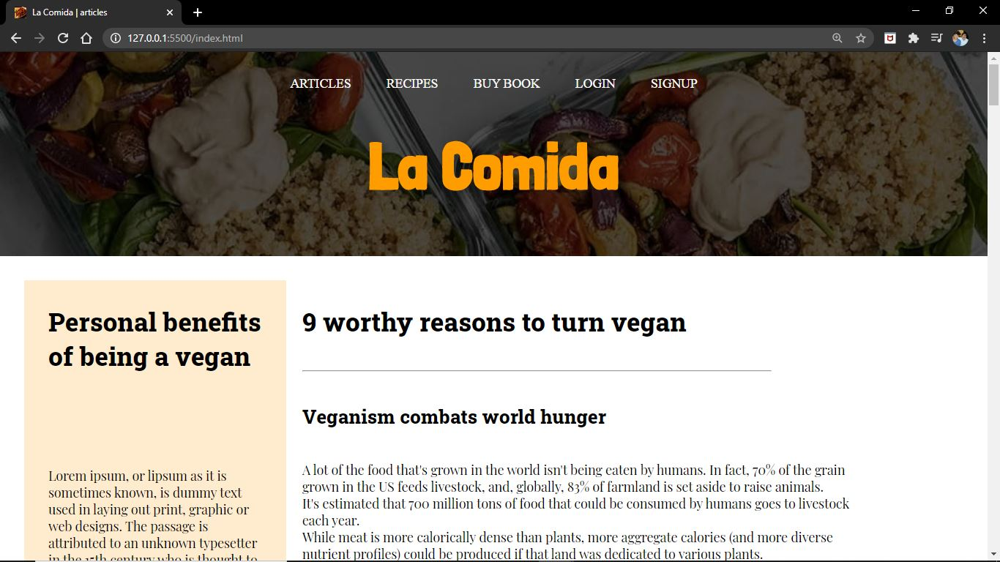
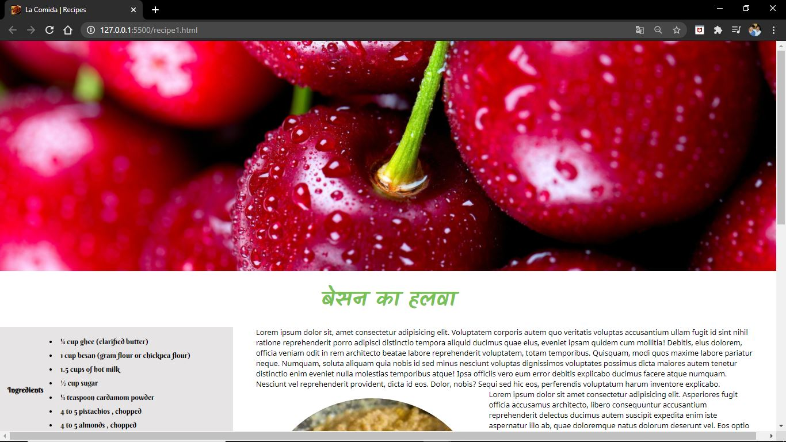
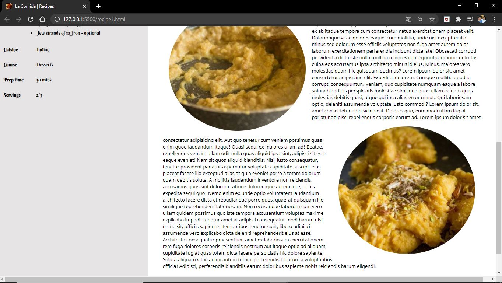
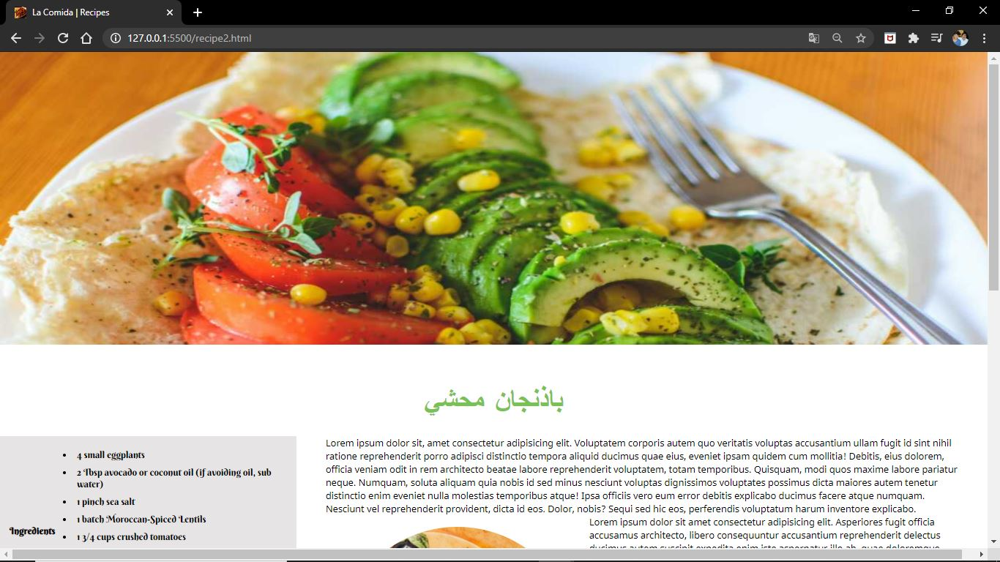
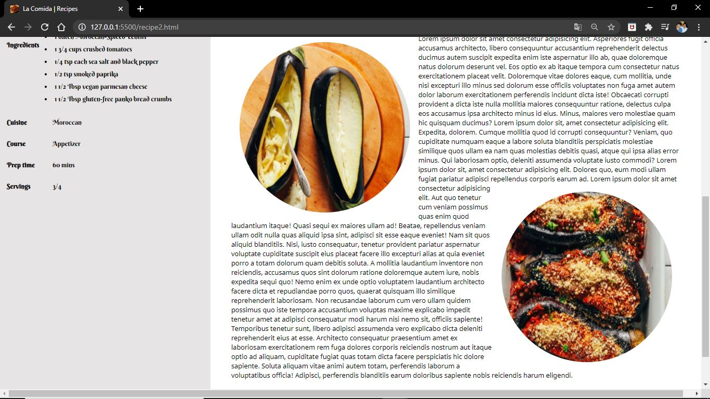

# **RECIPE BLOG**
### vegetarian recipe blog to promote a sustainable way of life
**https://project-wt.github.io/recipe-blog/**

Here are a few screenshots of the website:

**ARTICLE PAGE**

**RECIPE PAGE (BESAN KA HALWA)**

**RECIPE PAGE (BESAN KA HALWA)**

**RECIPE PAGE (STUFFED EGGPLANT)**

**RECIPE PAGE (STUFFED EGGPLANT)**

