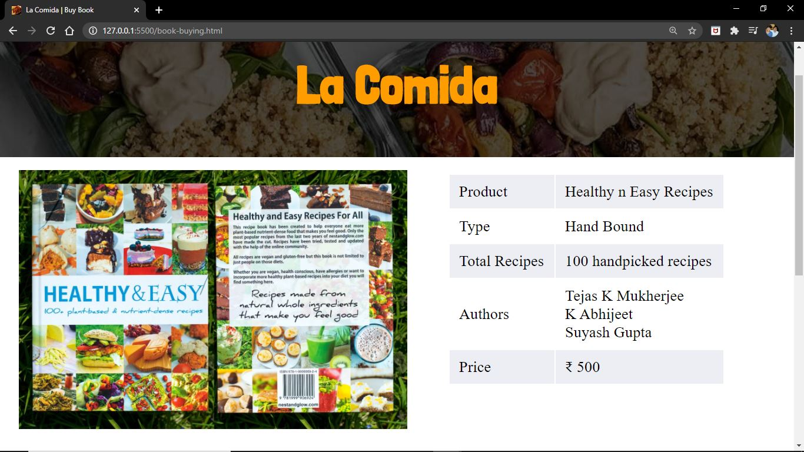
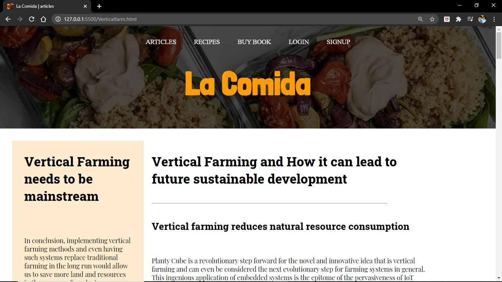

# **RECIPE BLOG**
### vegetarian recipe blog to promote a sustainable way of life
**https://project-wt.github.io/recipe-blog/**
Here are a few screenshots of the website:

 **ARTICLE PAGE**
 

**RECIPE PAGE (BESAN KA HALWA)**

**RECIPE PAGE (STUFFED EGGPLANT)**

**BUY BOOK**

**ARTICLES ON VERTICAL FARMING**

**REGISTER FOR WEEKLY NEWSLETTER**

